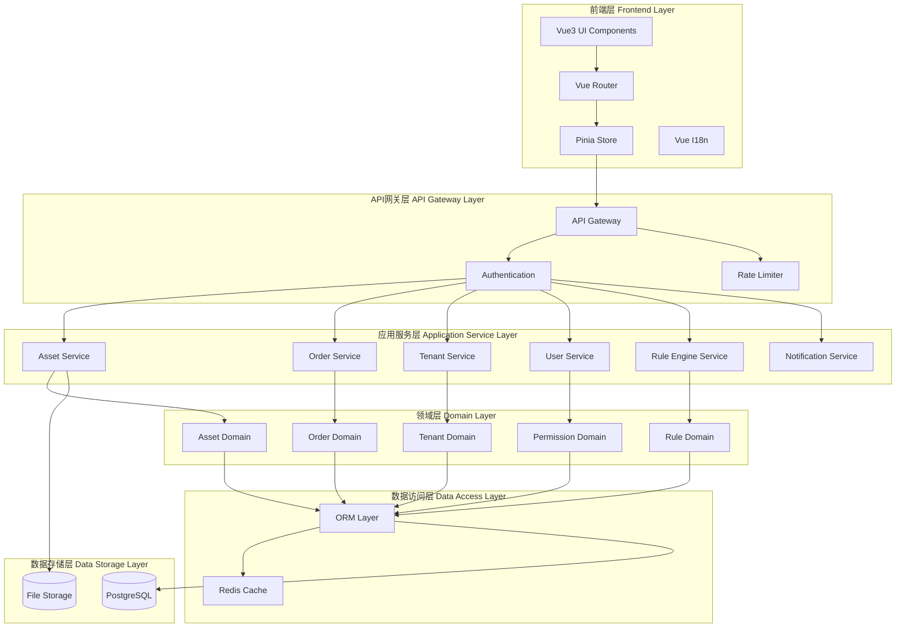
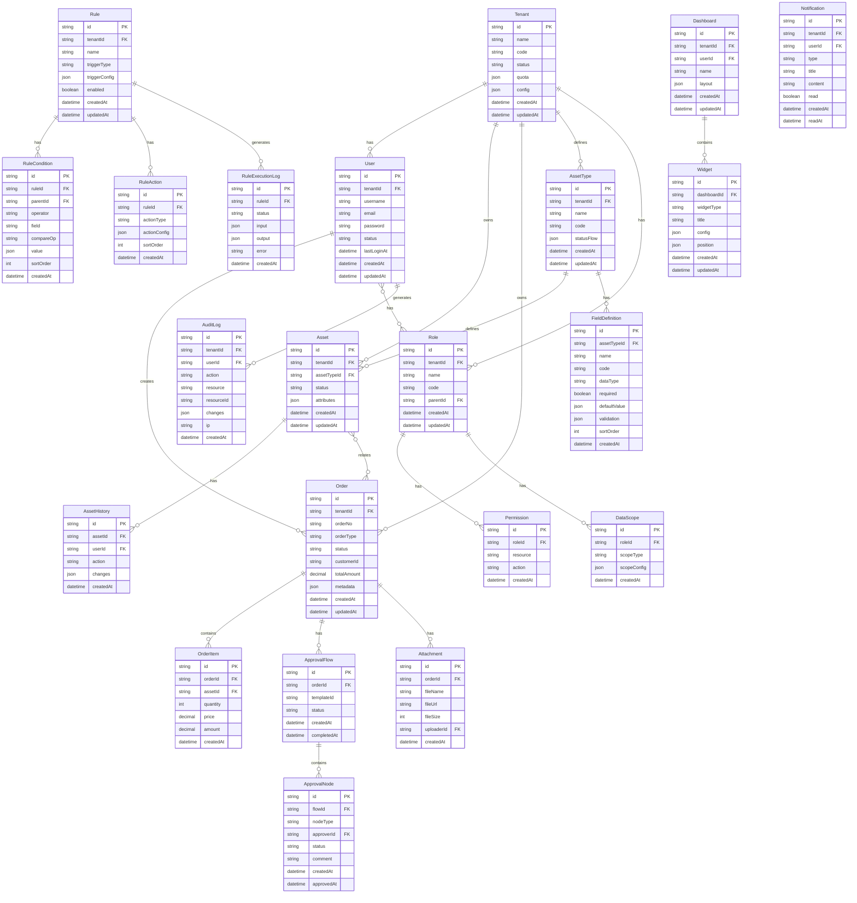

# 设计文档 - 通用中台资产监管平台

## Overview

### 系统概述

通用中台资产监管平台是一个领域无关的资产管理解决方案，旨在将现有的特定领域资产监管系统改造为通用化的中台系统。平台采用前后端分离架构，基于Vue3 + TypeScript构建前端应用，提供多租户支持、细粒度权限控制、灵活的订单管理和可配置的规则引擎。

### 技术栈

**前端技术栈：**
- Vue 3.4+ - 渐进式JavaScript框架
- TypeScript 5.3+ - 类型安全的JavaScript超集
- Vite 5.1+ - 下一代前端构建工具
- Pinia 2.1+ - Vue状态管理库
- Vue Router 4.3+ - Vue官方路由管理器
- Element Plus 2.6+ - Vue 3组件库
- UnoCSS 0.58+ - 即时按需原子CSS引擎
- Vue I18n 9.10+ - 国际化插件

**后端技术栈（推荐）：**
- Node.js 20+ / Bun 1.3+
- NestJS - 渐进式Node.js框架
- TypeORM / Prisma - ORM框架
- PostgreSQL - 关系型数据库
- Redis - 缓存和会话存储
- JWT - 身份认证

### 核心设计原则

1. **领域无关性** - 通过元数据驱动和动态配置实现跨领域适配
2. **多租户隔离** - 数据和配置完全隔离，确保租户间安全性
3. **权限细粒度** - 基于资源-操作-数据范围的三维权限模型
4. **可扩展性** - 插件化架构支持功能模块的灵活扩展
5. **配置化优先** - 通过配置而非代码实现业务逻辑定制


## Architecture

### 系统架构图



### 架构分层说明

#### 1. 前端层 (Frontend Layer)

前端采用Vue3组合式API和TypeScript构建，实现响应式用户界面和状态管理。

**核心模块：**
- **UI Components** - 基于Element Plus的业务组件库
- **Router** - 路由管理和权限守卫
- **Store** - Pinia状态管理，包括用户状态、租户配置、权限缓存
- **I18n** - 多语言支持（中文、英文）

#### 2. API网关层 (API Gateway Layer)

统一的API入口，处理认证、授权、限流和请求路由。

**核心功能：**
- **Authentication** - JWT令牌验证和刷新
- **Authorization** - 基于角色和权限的访问控制
- **Rate Limiting** - API调用频率限制
- **Request Logging** - 请求日志记录

#### 3. 应用服务层 (Application Service Layer)

实现具体的业务用例和服务编排，协调多个领域对象完成业务流程。

**核心服务：**
- **Asset Service** - 资产管理服务
- **Order Service** - 订单管理服务
- **Tenant Service** - 租户管理服务
- **User Service** - 用户和权限管理服务
- **Rule Engine Service** - 规则引擎服务
- **Notification Service** - 通知服务

#### 4. 领域层 (Domain Layer)

封装核心业务逻辑和领域模型，保持领域纯粹性。

**核心领域：**
- **Asset Domain** - 资产实体、资产类型、属性定义
- **Order Domain** - 订单实体、订单流程、审批流
- **Tenant Domain** - 租户实体、配额管理
- **Permission Domain** - 角色、权限、数据范围
- **Rule Domain** - 规则定义、条件表达式、执行引擎

#### 5. 数据访问层 (Data Access Layer)

提供统一的数据访问接口，支持缓存和数据库操作。

**核心组件：**
- **ORM Layer** - 对象关系映射
- **Redis Cache** - 缓存热点数据和会话信息

#### 6. 数据存储层 (Data Storage Layer)

持久化存储业务数据和文件。

**存储组件：**
- **PostgreSQL** - 主数据库
- **File Storage** - 文件存储（本地/OSS）


## Components and Interfaces

### 前端组件架构

#### 核心模块结构

```
src/
├── api/                    # API接口层
│   ├── asset.ts           # 资产API
│   ├── order.ts           # 订单API
│   ├── tenant.ts          # 租户API
│   ├── user.ts            # 用户API
│   ├── rule.ts            # 规则API
│   └── request.ts         # HTTP请求封装
├── components/            # 通用组件
│   ├── AssetForm/         # 动态资产表单
│   ├── PermissionButton/  # 权限按钮
│   ├── DataTable/         # 数据表格
│   ├── RuleBuilder/       # 规则构建器
│   └── Dashboard/         # 仪表板组件
├── composables/           # 组合式函数
│   ├── usePermission.ts   # 权限检查
│   ├── useTenant.ts       # 租户上下文
│   ├── useAssetType.ts    # 资产类型
│   └── useTable.ts        # 表格逻辑
├── directives/            # 自定义指令
│   └── permission.ts      # 权限指令
├── i18n/                  # 国际化
│   └── locales/
│       ├── zh-CN.ts       # 中文
│       └── en-US.ts       # 英文
├── router/                # 路由配置
│   ├── index.ts           # 路由定义
│   └── guards.ts          # 路由守卫
├── stores/                # 状态管理
│   ├── user.ts            # 用户状态
│   ├── tenant.ts          # 租户状态
│   ├── permission.ts      # 权限状态
│   └── app.ts             # 应用状态
├── types/                 # TypeScript类型
│   ├── asset.ts           # 资产类型
│   ├── order.ts           # 订单类型
│   ├── user.ts            # 用户类型
│   └── common.ts          # 通用类型
├── utils/                 # 工具函数
│   ├── auth.ts            # 认证工具
│   ├── validator.ts       # 验证工具
│   └── formatter.ts       # 格式化工具
└── views/                 # 页面视图
    ├── asset/             # 资产管理
    ├── order/             # 订单管理
    ├── tenant/            # 租户管理
    ├── system/            # 系统管理
    ├── dashboard/         # 仪表板
    └── login/             # 登录页
```

#### 关键组件接口

##### 1. AssetForm - 动态资产表单组件

```typescript
interface AssetFormProps {
  assetTypeId: string
  modelValue?: AssetData
  mode: 'create' | 'edit' | 'view'
}

interface AssetFormEmits {
  (e: 'update:modelValue', value: AssetData): void
  (e: 'submit', value: AssetData): void
  (e: 'cancel'): void
}

interface AssetData {
  id?: string
  assetTypeId: string
  tenantId: string
  status: string
  attributes: Record<string, any>
  createdAt?: string
  updatedAt?: string
}
```

##### 2. RuleBuilder - 规则构建器组件

```typescript
interface RuleBuilderProps {
  modelValue?: RuleConfig
  availableFields: FieldDefinition[]
}

interface RuleConfig {
  id?: string
  name: string
  triggerType: 'data_change' | 'schedule' | 'manual'
  conditions: ConditionGroup
  actions: Action[]
  enabled: boolean
}

interface ConditionGroup {
  operator: 'AND' | 'OR'
  conditions: (Condition | ConditionGroup)[]
}

interface Condition {
  field: string
  operator: 'eq' | 'ne' | 'gt' | 'lt' | 'contains' | 'regex'
  value: any
}

interface Action {
  type: 'update_data' | 'change_status' | 'send_notification' | 'call_api'
  config: Record<string, any>
}
```

##### 3. DataTable - 数据表格组件

```typescript
interface DataTableProps {
  columns: ColumnDefinition[]
  dataSource: (params: QueryParams) => Promise<PageResult<any>>
  rowKey: string
  permissions?: {
    create?: string
    edit?: string
    delete?: string
    export?: string
  }
}

interface ColumnDefinition {
  key: string
  label: string
  type?: 'text' | 'number' | 'date' | 'enum' | 'custom'
  width?: number
  sortable?: boolean
  filterable?: boolean
  formatter?: (value: any, row: any) => string
  render?: (row: any) => VNode
}

interface QueryParams {
  page: number
  pageSize: number
  sort?: { field: string; order: 'asc' | 'desc' }
  filters?: Record<string, any>
}

interface PageResult<T> {
  items: T[]
  total: number
  page: number
  pageSize: number
}
```

### 后端服务接口

#### RESTful API设计

##### 资产管理API

```typescript
// 资产类型管理
POST   /api/asset-types              // 创建资产类型
GET    /api/asset-types              // 查询资产类型列表
GET    /api/asset-types/:id          // 获取资产类型详情
PUT    /api/asset-types/:id          // 更新资产类型
DELETE /api/asset-types/:id          // 删除资产类型

// 资产管理
POST   /api/assets                   // 创建资产
GET    /api/assets                   // 查询资产列表
GET    /api/assets/:id               // 获取资产详情
PUT    /api/assets/:id               // 更新资产
DELETE /api/assets/:id               // 删除资产
POST   /api/assets/import            // 批量导入资产
POST   /api/assets/export            // 导出资产数据
GET    /api/assets/:id/history       // 获取资产变更历史
```

##### 订单管理API

```typescript
// 订单管理
POST   /api/orders                   // 创建订单
GET    /api/orders                   // 查询订单列表
GET    /api/orders/:id               // 获取订单详情
PUT    /api/orders/:id               // 更新订单
DELETE /api/orders/:id               // 删除订单
POST   /api/orders/:id/submit        // 提交订单审批
POST   /api/orders/:id/approve       // 审批通过
POST   /api/orders/:id/reject        // 审批拒绝
GET    /api/orders/:id/approval-flow // 获取审批流程
POST   /api/orders/:id/attachments   // 上传附件
```

##### 租户管理API

```typescript
// 租户管理
POST   /api/tenants                  // 创建租户
GET    /api/tenants                  // 查询租户列表
GET    /api/tenants/:id              // 获取租户详情
PUT    /api/tenants/:id              // 更新租户
PUT    /api/tenants/:id/status       // 启用/停用租户
PUT    /api/tenants/:id/quota        // 更新租户配额
GET    /api/tenants/:id/config       // 获取租户配置
PUT    /api/tenants/:id/config       // 更新租户配置
```

##### 用户和权限API

```typescript
// 用户管理
POST   /api/users                    // 创建用户
GET    /api/users                    // 查询用户列表
GET    /api/users/:id                // 获取用户详情
PUT    /api/users/:id                // 更新用户
DELETE /api/users/:id                // 删除用户
PUT    /api/users/:id/status         // 启用/禁用用户
PUT    /api/users/:id/roles          // 分配角色

// 角色管理
POST   /api/roles                    // 创建角色
GET    /api/roles                    // 查询角色列表
GET    /api/roles/:id                // 获取角色详情
PUT    /api/roles/:id                // 更新角色
DELETE /api/roles/:id                // 删除角色
PUT    /api/roles/:id/permissions    // 配置角色权限

// 权限管理
GET    /api/permissions              // 获取权限列表
GET    /api/permissions/tree         // 获取权限树
GET    /api/users/:id/permissions    // 获取用户权限
```

##### 规则引擎API

```typescript
// 规则管理
POST   /api/rules                    // 创建规则
GET    /api/rules                    // 查询规则列表
GET    /api/rules/:id                // 获取规则详情
PUT    /api/rules/:id                // 更新规则
DELETE /api/rules/:id                // 删除规则
PUT    /api/rules/:id/status         // 启用/禁用规则
POST   /api/rules/:id/test           // 测试规则
GET    /api/rules/:id/execution-log  // 获取规则执行日志
POST   /api/rules/:id/execute        // 手动执行规则
```

##### 仪表板API

```typescript
// 仪表板
GET    /api/dashboards               // 获取仪表板列表
GET    /api/dashboards/:id           // 获取仪表板配置
PUT    /api/dashboards/:id           // 更新仪表板配置
POST   /api/dashboards/:id/widgets   // 添加图表组件
DELETE /api/dashboards/:id/widgets/:widgetId // 删除图表组件
GET    /api/dashboards/data/:widgetId // 获取图表数据
```

##### 审计日志API

```typescript
// 审计日志
GET    /api/audit-logs               // 查询审计日志
GET    /api/audit-logs/:id           // 获取日志详情
POST   /api/audit-logs/export        // 导出审计日志
```

##### 通知API

```typescript
// 通知管理
GET    /api/notifications            // 获取通知列表
GET    /api/notifications/unread-count // 获取未读数量
PUT    /api/notifications/:id/read   // 标记为已读
DELETE /api/notifications/:id        // 删除通知
PUT    /api/notifications/read-all   // 全部标记为已读
GET    /api/notifications/preferences // 获取通知偏好
PUT    /api/notifications/preferences // 更新通知偏好
```

##### 系统配置API

```typescript
// 系统配置
GET    /api/system/config            // 获取系统配置
PUT    /api/system/config            // 更新系统配置
POST   /api/system/config/export     // 导出配置
POST   /api/system/config/import     // 导入配置
```

#### API请求/响应格式

##### 统一响应格式

```typescript
interface ApiResponse<T = any> {
  code: number          // 业务状态码
  message: string       // 响应消息
  data: T              // 响应数据
  timestamp: number    // 时间戳
  traceId?: string     // 追踪ID
}

// 成功响应示例
{
  "code": 200,
  "message": "success",
  "data": { ... },
  "timestamp": 1704067200000
}

// 错误响应示例
{
  "code": 400,
  "message": "Invalid parameters",
  "data": {
    "errors": [
      { "field": "name", "message": "Name is required" }
    ]
  },
  "timestamp": 1704067200000
}
```

##### 分页响应格式

```typescript
interface PageResponse<T> {
  items: T[]           // 数据列表
  total: number        // 总记录数
  page: number         // 当前页码
  pageSize: number     // 每页大小
  totalPages: number   // 总页数
}
```


## Data Models

### 核心实体关系图



### 数据模型详细说明

#### 1. 租户模型 (Tenant)

```typescript
interface Tenant {
  id: string                    // 租户ID
  name: string                  // 租户名称
  code: string                  // 租户编码（唯一）
  status: 'active' | 'inactive' // 状态
  quota: {                      // 资源配额
    maxUsers: number            // 最大用户数
    maxAssets: number           // 最大资产数
    maxStorage: number          // 最大存储空间(MB)
  }
  config: {                     // 租户配置
    logo?: string               // Logo URL
    theme?: {                   // 主题配置
      primaryColor: string
      secondaryColor: string
    }
    features?: string[]         // 启用的功能模块
    locale?: string             // 默认语言
  }
  createdAt: Date
  updatedAt: Date
}
```

#### 2. 用户模型 (User)

```typescript
interface User {
  id: string
  tenantId: string              // 所属租户
  username: string              // 用户名（租户内唯一）
  email: string                 // 邮箱
  password: string              // 密码哈希
  status: 'active' | 'inactive' | 'locked'
  profile?: {                   // 用户资料
    realName?: string
    phone?: string
    avatar?: string
    department?: string
  }
  lastLoginAt?: Date
  createdAt: Date
  updatedAt: Date
}
```

#### 3. 角色模型 (Role)

```typescript
interface Role {
  id: string
  tenantId: string
  name: string                  // 角色名称
  code: string                  // 角色编码
  parentId?: string             // 父角色ID（支持角色继承）
  description?: string
  createdAt: Date
  updatedAt: Date
}
```

#### 4. 权限模型 (Permission)

```typescript
interface Permission {
  id: string
  roleId: string
  resource: string              // 资源标识，如 'asset', 'order'
  action: string                // 操作类型：'view', 'create', 'edit', 'delete', 'export'
  createdAt: Date
}

interface DataScope {
  id: string
  roleId: string
  scopeType: 'all' | 'tenant' | 'department' | 'self'
  scopeConfig?: {               // 范围配置
    departments?: string[]      // 部门列表
    customFilter?: any          // 自定义过滤条件
  }
  createdAt: Date
}
```

#### 5. 资产类型模型 (AssetType)

```typescript
interface AssetType {
  id: string
  tenantId: string
  name: string                  // 类型名称
  code: string                  // 类型编码
  description?: string
  statusFlow: {                 // 状态流转配置
    states: Array<{
      code: string
      name: string
      color?: string
    }>
    transitions: Array<{
      from: string
      to: string
      action: string
      condition?: any
    }>
  }
  createdAt: Date
  updatedAt: Date
}

interface FieldDefinition {
  id: string
  assetTypeId: string
  name: string                  // 字段名称
  code: string                  // 字段编码
  dataType: 'string' | 'number' | 'date' | 'boolean' | 'enum' | 'reference'
  required: boolean
  defaultValue?: any
  validation?: {                // 验证规则
    min?: number
    max?: number
    pattern?: string
    options?: string[]          // 枚举选项
    referenceType?: string      // 关联对象类型
  }
  displayConfig?: {             // 显示配置
    placeholder?: string
    helpText?: string
    width?: number
  }
  sortOrder: number
  createdAt: Date
}
```

#### 6. 资产模型 (Asset)

```typescript
interface Asset {
  id: string
  tenantId: string
  assetTypeId: string
  status: string                // 当前状态
  attributes: Record<string, any> // 动态属性
  createdAt: Date
  updatedAt: Date
}

interface AssetHistory {
  id: string
  assetId: string
  userId: string
  action: 'create' | 'update' | 'delete' | 'status_change'
  changes: {                    // 变更内容
    field: string
    oldValue: any
    newValue: any
  }[]
  createdAt: Date
}
```

#### 7. 订单模型 (Order)

```typescript
interface Order {
  id: string
  tenantId: string
  orderNo: string               // 订单号
  orderType: string             // 订单类型
  status: string                // 订单状态
  customerId?: string           // 客户ID
  totalAmount: number           // 总金额
  metadata?: Record<string, any> // 扩展元数据
  createdBy: string
  createdAt: Date
  updatedAt: Date
}

interface OrderItem {
  id: string
  orderId: string
  assetId: string
  quantity: number
  price: number
  amount: number
  createdAt: Date
}

interface Attachment {
  id: string
  orderId: string
  fileName: string
  fileUrl: string
  fileSize: number
  uploaderId: string
  createdAt: Date
}
```

#### 8. 审批流程模型 (ApprovalFlow)

```typescript
interface ApprovalFlow {
  id: string
  orderId: string
  templateId: string            // 审批模板ID
  status: 'pending' | 'approved' | 'rejected' | 'cancelled'
  createdAt: Date
  completedAt?: Date
}

interface ApprovalNode {
  id: string
  flowId: string
  nodeType: 'serial' | 'parallel' // 串行或并行
  approverId: string
  status: 'pending' | 'approved' | 'rejected' | 'skipped'
  comment?: string
  createdAt: Date
  approvedAt?: Date
}
```

#### 9. 规则引擎模型 (Rule)

```typescript
interface Rule {
  id: string
  tenantId: string
  name: string
  description?: string
  triggerType: 'data_change' | 'schedule' | 'manual'
  triggerConfig: {
    // data_change配置
    entity?: string
    events?: ('create' | 'update' | 'delete')[]
    // schedule配置
    cron?: string
  }
  enabled: boolean
  createdAt: Date
  updatedAt: Date
}

interface RuleCondition {
  id: string
  ruleId: string
  parentId?: string             // 父条件ID（用于嵌套）
  operator: 'AND' | 'OR'        // 逻辑运算符
  field?: string                // 字段名
  compareOp?: 'eq' | 'ne' | 'gt' | 'lt' | 'gte' | 'lte' | 'contains' | 'regex'
  value?: any                   // 比较值
  sortOrder: number
  createdAt: Date
}

interface RuleAction {
  id: string
  ruleId: string
  actionType: 'update_data' | 'change_status' | 'send_notification' | 'call_api'
  actionConfig: {
    // update_data配置
    entity?: string
    updates?: Record<string, any>
    // send_notification配置
    recipients?: string[]
    template?: string
    // call_api配置
    url?: string
    method?: string
    headers?: Record<string, string>
    body?: any
  }
  sortOrder: number
  createdAt: Date
}

interface RuleExecutionLog {
  id: string
  ruleId: string
  status: 'success' | 'failed'
  input: any                    // 输入数据
  output?: any                  // 输出结果
  error?: string                // 错误信息
  executionTime: number         // 执行耗时(ms)
  createdAt: Date
}
```

#### 10. 仪表板模型 (Dashboard)

```typescript
interface Dashboard {
  id: string
  tenantId: string
  userId: string                // 所有者
  name: string
  layout: {                     // 布局配置
    cols: number
    rowHeight: number
  }
  isDefault: boolean
  createdAt: Date
  updatedAt: Date
}

interface Widget {
  id: string
  dashboardId: string
  widgetType: 'line' | 'bar' | 'pie' | 'card' | 'table'
  title: string
  config: {                     // 图表配置
    dataSource: string          // 数据源
    query?: any                 // 查询条件
    xAxis?: string
    yAxis?: string
    series?: any[]
    refreshInterval?: number    // 刷新间隔(秒)
  }
  position: {                   // 位置和大小
    x: number
    y: number
    w: number
    h: number
  }
  createdAt: Date
  updatedAt: Date
}
```

#### 11. 审计日志模型 (AuditLog)

```typescript
interface AuditLog {
  id: string
  tenantId: string
  userId: string
  action: string                // 操作类型
  resource: string              // 资源类型
  resourceId: string            // 资源ID
  changes?: {                   // 变更详情
    field: string
    oldValue: any
    newValue: any
  }[]
  ip: string                    // IP地址
  userAgent?: string            // 用户代理
  createdAt: Date
}
```

#### 12. 通知模型 (Notification)

```typescript
interface Notification {
  id: string
  tenantId: string
  userId: string
  type: 'approval' | 'rule_execution' | 'system_announcement'
  title: string
  content: string
  read: boolean
  metadata?: {                  // 扩展数据
    relatedId?: string
    relatedType?: string
    actionUrl?: string
  }
  createdAt: Date
  readAt?: Date
}
```

### 数据库索引策略

```sql
-- 租户表索引
CREATE INDEX idx_tenant_code ON tenant(code);
CREATE INDEX idx_tenant_status ON tenant(status);

-- 用户表索引
CREATE INDEX idx_user_tenant ON user(tenant_id);
CREATE INDEX idx_user_username ON user(tenant_id, username);
CREATE INDEX idx_user_email ON user(email);
CREATE INDEX idx_user_status ON user(status);

-- 资产表索引
CREATE INDEX idx_asset_tenant ON asset(tenant_id);
CREATE INDEX idx_asset_type ON asset(asset_type_id);
CREATE INDEX idx_asset_status ON asset(status);
CREATE INDEX idx_asset_created ON asset(created_at);

-- 订单表索引
CREATE INDEX idx_order_tenant ON "order"(tenant_id);
CREATE INDEX idx_order_no ON "order"(order_no);
CREATE INDEX idx_order_status ON "order"(status);
CREATE INDEX idx_order_created ON "order"(created_at);

-- 审计日志索引
CREATE INDEX idx_audit_tenant ON audit_log(tenant_id);
CREATE INDEX idx_audit_user ON audit_log(user_id);
CREATE INDEX idx_audit_resource ON audit_log(resource, resource_id);
CREATE INDEX idx_audit_created ON audit_log(created_at);

-- 规则执行日志索引
CREATE INDEX idx_rule_log_rule ON rule_execution_log(rule_id);
CREATE INDEX idx_rule_log_status ON rule_execution_log(status);
CREATE INDEX idx_rule_log_created ON rule_execution_log(created_at);
```


## Correctness Properties

属性是系统所有有效执行中应该保持为真的特征或行为——本质上是关于系统应该做什么的形式化陈述。属性作为人类可读规范和机器可验证正确性保证之间的桥梁。

### 属性反思

在分析了所有验收标准后，我识别出以下可以合并或优化的属性：

**合并的属性：**
1. 多个关于"CRUD操作"的属性（1.3, 3.1, 4.1, 4.3, 6.1）可以合并为通用的实体管理属性
2. 多个关于"审计日志记录"的属性（1.6, 5.7, 7.7, 8.7, 11.1, 12.7, 15.5）可以合并为统一的审计日志属性
3. 多个关于"查询过滤"的属性（1.4, 6.5, 11.3）可以合并为通用的查询过滤属性
4. 多个关于"权限验证"的属性（4.4, 4.5, 12.4）可以合并为统一的权限检查属性
5. 多个关于"数据范围过滤"的属性（3.3, 3.4, 5.4, 10.4, 13.5）可以合并为租户和权限数据隔离属性
6. 多个关于"导入导出往返"的属性（1.5, 9.7, 15.6）可以合并为数据序列化往返属性
7. 多个关于"配额限制"的属性（3.6）和"删除约束"（2.5）可以合并为资源约束验证属性

**保留的独立属性：**
- 动态表单生成（1.2）- 元数据驱动的核心特性
- 状态流转验证（2.4, 6.3）- 状态机逻辑
- 角色继承（4.6）- 权限模型特性
- 规则引擎执行（8.5）- 规则引擎核心
- 审批流程（7.3, 7.5, 7.6）- 工作流逻辑
- 日志不可变性（11.4）- 安全特性

### 属性 1: 实体CRUD往返一致性

*对于任何*实体类型（资产、订单、用户、角色、租户等），创建实体后查询应该能获取到相同的数据，更新后应该反映变更，删除后不应该能查询到。

**验证需求: 1.3, 3.1, 4.1, 4.3, 6.1**

### 属性 2: 动态表单字段一致性

*对于任何*资产类型定义，根据该类型生成的表单字段应该与类型定义中的字段定义完全一致，包括字段名称、数据类型、是否必填和默认值。

**验证需求: 1.2, 2.1**

### 属性 3: 查询过滤正确性

*对于任何*查询条件（资产类型、状态、租户、订单号、时间范围等），返回的结果集中的每一项都应该满足该查询条件。

**验证需求: 1.4, 6.5, 11.3**

### 属性 4: 分页和排序一致性

*对于任何*数据集合，分页查询的所有页合并后应该等于完整数据集，排序后的结果应该符合指定的排序规则。

**验证需求: 1.7**

### 属性 5: 数据导入导出往返一致性

*对于任何*可导出的数据集（资产、订单、用户、规则配置、系统配置），导出后再导入应该得到等价的数据。

**验证需求: 1.5, 9.7, 13.4, 13.6, 15.6**

### 属性 6: 资产类型修改数据一致性验证

*对于任何*资产类型定义的修改，如果该修改会导致现有资产实例的数据不一致（如删除必填字段、修改字段类型），系统应该拒绝该修改操作。

**验证需求: 2.3**

### 属性 7: 状态流转规则验证

*对于任何*配置了状态流转规则的实体（资产、订单），状态变更操作只有在符合配置的流转规则时才能成功执行。

**验证需求: 2.4, 6.2, 6.3**

### 属性 8: 资源约束验证

*对于任何*受约束的资源操作（删除有实例的资产类型、超出租户配额的创建操作），系统应该拒绝操作并返回明确的错误信息。

**验证需求: 2.5, 3.6**

### 属性 9: 租户标识唯一性

*对于任何*新创建的租户，其标识符应该是全局唯一的，不与任何现有租户的标识符重复。

**验证需求: 3.2**

### 属性 10: 租户数据完全隔离

*对于任何*租户的用户执行的查询操作，返回的数据应该只包含该租户的数据，不包含任何其他租户的数据。

**验证需求: 3.3, 3.4, 5.4**

### 属性 11: 租户配置持久化一致性

*对于任何*租户的个性化配置（Logo、主题色、功能模块、资源配额），保存后再读取应该得到相同的配置值。

**验证需求: 3.5, 3.7**

### 属性 12: 用户角色关联正确性

*对于任何*用户，分配角色后查询用户的角色列表应该包含所有已分配的角色，移除角色后不应该再包含该角色。

**验证需求: 4.2**

### 属性 13: 权限验证拒绝无权操作

*对于任何*需要权限的操作，如果执行用户不具有对应的权限（资源-操作-数据范围），系统应该拒绝操作并返回权限不足的错误。

**验证需求: 4.4, 4.5, 12.4**

### 属性 14: 角色继承权限传递

*对于任何*具有父角色的子角色，子角色应该自动拥有父角色的所有权限，且权限修改应该立即对所有拥有该角色的用户生效。

**验证需求: 4.6, 4.7**

### 属性 15: 数据范围权限过滤

*对于任何*配置了数据范围权限的用户（全部/租户/部门/本人），查询数据时返回的结果应该自动过滤为该用户有权访问的数据范围。

**验证需求: 5.3, 5.4, 10.4, 13.5**

### 属性 16: 访问控制列表生效

*对于任何*配置了ACL的资源实例，只有在ACL中的用户才能访问该资源，不在ACL中的用户应该被拒绝访问。

**验证需求: 5.5**

### 属性 17: 权限驱动UI元素可见性

*对于任何*需要特定权限的UI功能（按钮、菜单项），用户界面应该根据当前用户的权限动态显示或隐藏这些元素。

**验证需求: 5.6**

### 属性 18: 订单资产级联状态更新

*对于任何*涉及资产状态变更的订单，当订单状态变更时，关联的资产状态应该自动更新为对应的状态。

**验证需求: 6.6**

### 属性 19: 订单统计计算正确性

*对于任何*订单数据集，统计报表中的订单数量、金额汇总和状态分布应该与实际数据完全一致。

**验证需求: 6.7**

### 属性 20: 审批流程节点创建

*对于任何*提交审批的订单，系统应该根据订单类型对应的审批流程模板创建所有审批节点，并向审批人发送通知。

**验证需求: 7.1, 7.2, 7.3**

### 属性 21: 审批拒绝状态回退

*对于任何*被拒绝的审批，订单状态应该回退到审批前的状态，并向提交人发送拒绝通知。

**验证需求: 7.5**

### 属性 22: 审批完成自动更新

*对于任何*审批流程，当所有审批节点都通过时，订单状态应该自动更新为"已审批"状态。

**验证需求: 7.6**

### 属性 23: 规则条件触发执行

*对于任何*启用的规则，当触发条件满足时（数据变更、定时任务、手动触发），系统应该自动执行规则定义的所有动作。

**验证需求: 8.2, 8.5, 8.6**

### 属性 24: 规则条件表达式求值

*对于任何*规则条件表达式（包含逻辑运算符AND/OR和比较运算符），给定输入数据，表达式的求值结果应该符合布尔逻辑规则。

**验证需求: 9.2, 9.3, 9.4**

### 属性 25: 规则条件语法验证

*对于任何*规则条件表达式，如果语法不正确或引用了不存在的字段，保存时应该被拒绝并返回语法错误信息。

**验证需求: 9.5**

### 属性 26: 规则测试功能正确性

*对于任何*规则和测试输入数据，规则测试功能返回的结果应该与实际执行该规则时的结果一致。

**验证需求: 9.6**

### 属性 27: 仪表板布局配置持久化

*对于任何*仪表板的布局配置（图表位置、大小、刷新频率），保存后再加载应该得到相同的布局配置。

**验证需求: 10.3, 10.5**

### 属性 28: 仪表板时间范围过滤

*对于任何*仪表板图表的时间范围筛选，返回的数据应该只包含该时间范围内的数据点。

**验证需求: 10.6**

### 属性 29: 审计日志完整记录

*对于任何*关键操作（用户登录、数据变更、权限修改、配置变更、审批操作、规则执行、API调用），系统应该在审计日志中记录操作时间、操作用户、操作类型、操作对象、操作结果和变更详情。

**验证需求: 1.6, 5.7, 7.7, 8.7, 11.1, 11.2, 11.7, 12.7, 15.5**

### 属性 30: 审计日志不可变性

*对于任何*已创建的审计日志记录，不应该存在任何修改或删除该记录的操作能够成功执行。

**验证需求: 11.4**

### 属性 31: 审计日志导出完整性

*对于任何*审计日志查询结果，导出的CSV或Excel文件应该包含所有查询结果的完整数据。

**验证需求: 11.5**

### 属性 32: 日志自动清理策略执行

*对于任何*配置了保留策略的日志类型（审计日志、消息通知），超过保留期限的记录应该被自动归档或清理。

**验证需求: 11.6, 14.7**

### 属性 33: API认证机制验证

*对于任何*API调用，如果未提供有效的认证凭证（API密钥或OAuth令牌），系统应该拒绝请求并返回401未授权错误。

**验证需求: 12.2, 12.4**

### 属性 34: API响应格式一致性

*对于任何*API请求，响应应该包含标准的HTTP状态码、统一的响应格式（code、message、data、timestamp）和明确的错误信息。

**验证需求: 12.5**

### 属性 35: 数据导入验证拒绝无效数据

*对于任何*导入文件，如果文件格式不正确或数据不完整（缺少必填字段、数据类型不匹配），系统应该拒绝导入并返回详细的错误报告（错误行号、错误原因）。

**验证需求: 13.1, 13.2, 13.3**

### 属性 36: 导入报告统计准确性

*对于任何*数据导入操作，生成的导入报告中的成功数量和失败数量之和应该等于导入文件的总记录数。

**验证需求: 13.7**

### 属性 37: 业务事件触发通知

*对于任何*重要业务事件（订单审批、规则执行结果、系统公告），系统应该向相关用户发送通知消息，通知方式根据用户的通知偏好配置（站内消息、邮件、短信）。

**验证需求: 14.2, 14.3, 14.4**

### 属性 38: 未读消息计数准确性

*对于任何*用户，显示的未读消息数量应该等于该用户所有未读状态的通知消息的实际数量。

**验证需求: 14.5**

### 属性 39: 消息状态管理正确性

*对于任何*通知消息，标记为已读后查询应该显示为已读状态，删除后不应该再出现在用户的消息列表中。

**验证需求: 14.6**

### 属性 40: 系统配置验证拒绝无效值

*对于任何*系统配置项的修改，如果配置值不符合有效性规则（如负数的超时时间、超出范围的文件大小限制），系统应该拒绝修改并返回验证错误。

**验证需求: 15.2, 15.3**

### 属性 41: 系统配置分组管理

*对于任何*系统配置项，应该能够按照配置分组（安全配置、性能配置、业务配置）进行查询和管理。

**验证需求: 15.4**


## Error Handling

### 错误分类和处理策略

#### 1. 业务逻辑错误 (Business Logic Errors)

**错误码范围: 400-499**

这类错误由业务规则违反引起，应该向用户提供清晰的错误信息。

```typescript
enum BusinessErrorCode {
  // 验证错误 (400-409)
  VALIDATION_ERROR = 400,
  REQUIRED_FIELD_MISSING = 401,
  INVALID_DATA_TYPE = 402,
  INVALID_DATA_FORMAT = 403,
  DUPLICATE_ENTRY = 409,
  
  // 权限错误 (410-419)
  PERMISSION_DENIED = 410,
  INSUFFICIENT_PRIVILEGES = 411,
  DATA_SCOPE_VIOLATION = 412,
  
  // 资源错误 (420-429)
  RESOURCE_NOT_FOUND = 420,
  RESOURCE_ALREADY_EXISTS = 421,
  RESOURCE_IN_USE = 422,
  RESOURCE_LOCKED = 423,
  
  // 配额错误 (430-439)
  QUOTA_EXCEEDED = 430,
  USER_LIMIT_REACHED = 431,
  ASSET_LIMIT_REACHED = 432,
  STORAGE_LIMIT_REACHED = 433,
  
  // 状态错误 (440-449)
  INVALID_STATE_TRANSITION = 440,
  OPERATION_NOT_ALLOWED_IN_CURRENT_STATE = 441,
  
  // 业务规则错误 (450-459)
  BUSINESS_RULE_VIOLATION = 450,
  APPROVAL_REQUIRED = 451,
  DEPENDENCY_EXISTS = 452,
}
```

**处理策略：**
- 捕获业务逻辑异常并转换为标准错误响应
- 提供用户友好的错误消息（支持国际化）
- 记录到应用日志（info级别）
- 不记录到错误监控系统（非系统故障）

**示例：**
```typescript
// 前端错误处理
try {
  await assetService.create(assetData)
} catch (error) {
  if (error.code === BusinessErrorCode.QUOTA_EXCEEDED) {
    ElMessage.error(t('error.quotaExceeded'))
    // 显示配额详情对话框
  } else if (error.code === BusinessErrorCode.PERMISSION_DENIED) {
    ElMessage.error(t('error.permissionDenied'))
    // 跳转到权限申请页面
  }
}

// 后端错误处理
@Post('assets')
async createAsset(@Body() dto: CreateAssetDto) {
  const tenant = await this.tenantService.findById(dto.tenantId)
  
  if (tenant.assetCount >= tenant.quota.maxAssets) {
    throw new BusinessException(
      BusinessErrorCode.QUOTA_EXCEEDED,
      'Asset quota exceeded',
      { current: tenant.assetCount, max: tenant.quota.maxAssets }
    )
  }
  
  return this.assetService.create(dto)
}
```

#### 2. 认证和授权错误 (Authentication & Authorization Errors)

**错误码: 401, 403**

```typescript
enum AuthErrorCode {
  UNAUTHORIZED = 401,              // 未认证
  TOKEN_EXPIRED = 4011,           // 令牌过期
  TOKEN_INVALID = 4012,           // 令牌无效
  FORBIDDEN = 403,                // 已认证但无权限
  TENANT_INACTIVE = 4031,         // 租户已停用
  USER_INACTIVE = 4032,           // 用户已禁用
  USER_LOCKED = 4033,             // 用户已锁定
}
```

**处理策略：**
- 401错误：清除本地令牌，重定向到登录页
- 403错误：显示权限不足提示，提供权限申请入口
- 记录到安全审计日志
- 多次失败触发账号锁定机制

**示例：**
```typescript
// 前端全局错误拦截器
axios.interceptors.response.use(
  response => response,
  error => {
    if (error.response?.status === 401) {
      // 清除认证信息
      userStore.logout()
      // 重定向到登录页
      router.push('/login')
    } else if (error.response?.status === 403) {
      ElMessage.error(t('error.forbidden'))
    }
    return Promise.reject(error)
  }
)

// 后端认证守卫
@Injectable()
export class JwtAuthGuard implements CanActivate {
  canActivate(context: ExecutionContext): boolean {
    const request = context.switchToHttp().getRequest()
    const user = request.user
    
    if (!user) {
      throw new UnauthorizedException('Authentication required')
    }
    
    if (user.tenant.status !== 'active') {
      throw new ForbiddenException('Tenant is inactive')
    }
    
    if (user.status !== 'active') {
      throw new ForbiddenException('User is inactive')
    }
    
    return true
  }
}
```

#### 3. 系统错误 (System Errors)

**错误码: 500-599**

```typescript
enum SystemErrorCode {
  INTERNAL_SERVER_ERROR = 500,
  DATABASE_ERROR = 501,
  EXTERNAL_SERVICE_ERROR = 502,
  TIMEOUT_ERROR = 503,
  CONFIGURATION_ERROR = 504,
}
```

**处理策略：**
- 记录完整的错误堆栈到错误日志
- 发送到错误监控系统（如Sentry）
- 向用户显示通用错误消息（不暴露内部细节）
- 触发告警通知运维人员
- 实施熔断和降级策略

**示例：**
```typescript
// 全局异常过滤器
@Catch()
export class GlobalExceptionFilter implements ExceptionFilter {
  constructor(
    private readonly logger: Logger,
    private readonly errorTracker: ErrorTrackingService
  ) {}
  
  catch(exception: any, host: ArgumentsHost) {
    const ctx = host.switchToHttp()
    const response = ctx.getResponse()
    const request = ctx.getRequest()
    
    let status = 500
    let code = SystemErrorCode.INTERNAL_SERVER_ERROR
    let message = 'Internal server error'
    let details = null
    
    if (exception instanceof BusinessException) {
      status = 400
      code = exception.code
      message = exception.message
      details = exception.details
    } else if (exception instanceof HttpException) {
      status = exception.getStatus()
      message = exception.message
    } else {
      // 系统错误：记录详细日志并上报
      this.logger.error(
        `Unhandled exception: ${exception.message}`,
        exception.stack,
        {
          url: request.url,
          method: request.method,
          user: request.user?.id,
          tenant: request.user?.tenantId,
        }
      )
      
      // 上报到错误监控系统
      this.errorTracker.captureException(exception, {
        user: request.user,
        request: {
          url: request.url,
          method: request.method,
          headers: request.headers,
        },
      })
    }
    
    response.status(status).json({
      code,
      message,
      data: details,
      timestamp: Date.now(),
      traceId: request.traceId,
    })
  }
}
```

#### 4. 数据验证错误 (Validation Errors)

**处理策略：**
- 前端和后端双重验证
- 提供字段级别的错误提示
- 支持批量验证并返回所有错误

**示例：**
```typescript
// 前端表单验证
const assetFormRules = {
  name: [
    { required: true, message: t('validation.required'), trigger: 'blur' },
    { min: 2, max: 100, message: t('validation.length', { min: 2, max: 100 }), trigger: 'blur' }
  ],
  assetTypeId: [
    { required: true, message: t('validation.required'), trigger: 'change' }
  ],
  attributes: [
    { validator: validateAttributes, trigger: 'blur' }
  ]
}

// 后端DTO验证
export class CreateAssetDto {
  @IsNotEmpty()
  @Length(2, 100)
  name: string
  
  @IsUUID()
  assetTypeId: string
  
  @IsUUID()
  tenantId: string
  
  @IsObject()
  @ValidateNested()
  attributes: Record<string, any>
  
  @IsOptional()
  @IsString()
  status?: string
}

// 自定义验证器
@ValidatorConstraint({ name: 'assetAttributes', async: true })
export class AssetAttributesValidator implements ValidatorConstraintInterface {
  constructor(private assetTypeService: AssetTypeService) {}
  
  async validate(attributes: any, args: ValidationArguments) {
    const dto = args.object as CreateAssetDto
    const assetType = await this.assetTypeService.findById(dto.assetTypeId)
    
    // 验证所有必填字段都存在
    for (const field of assetType.fields) {
      if (field.required && !attributes[field.code]) {
        return false
      }
    }
    
    // 验证字段类型
    for (const [key, value] of Object.entries(attributes)) {
      const field = assetType.fields.find(f => f.code === key)
      if (field && !this.validateFieldType(value, field.dataType)) {
        return false
      }
    }
    
    return true
  }
  
  defaultMessage(args: ValidationArguments) {
    return 'Invalid asset attributes'
  }
}
```

#### 5. 并发冲突错误 (Concurrency Errors)

**处理策略：**
- 使用乐观锁检测并发修改
- 提示用户数据已被修改，需要刷新
- 提供冲突解决选项（保留本地/使用服务器版本/手动合并）

**示例：**
```typescript
// 实体版本控制
@Entity()
export class Asset {
  @PrimaryGeneratedColumn('uuid')
  id: string
  
  @Column()
  name: string
  
  @VersionColumn()
  version: number  // 乐观锁版本号
  
  @UpdateDateColumn()
  updatedAt: Date
}

// 更新时检查版本
async updateAsset(id: string, dto: UpdateAssetDto, expectedVersion: number) {
  const result = await this.assetRepository.update(
    { id, version: expectedVersion },
    { ...dto, version: expectedVersion + 1 }
  )
  
  if (result.affected === 0) {
    throw new BusinessException(
      BusinessErrorCode.RESOURCE_LOCKED,
      'Asset has been modified by another user',
      { id, expectedVersion }
    )
  }
  
  return this.assetRepository.findOne({ where: { id } })
}

// 前端处理并发冲突
try {
  await assetService.update(assetId, formData, currentVersion)
  ElMessage.success(t('message.updateSuccess'))
} catch (error) {
  if (error.code === BusinessErrorCode.RESOURCE_LOCKED) {
    ElMessageBox.confirm(
      t('error.concurrentModification'),
      t('common.warning'),
      {
        confirmButtonText: t('action.reload'),
        cancelButtonText: t('action.cancel'),
        type: 'warning'
      }
    ).then(() => {
      // 重新加载最新数据
      loadAssetData()
    })
  }
}
```

#### 6. 外部服务错误 (External Service Errors)

**处理策略：**
- 实施重试机制（指数退避）
- 设置超时时间
- 实施熔断器模式
- 提供降级方案

**示例：**
```typescript
// 外部API调用封装
export class ExternalApiService {
  private readonly circuitBreaker: CircuitBreaker
  
  constructor() {
    this.circuitBreaker = new CircuitBreaker({
      failureThreshold: 5,      // 5次失败后打开熔断器
      resetTimeout: 60000,      // 60秒后尝试恢复
    })
  }
  
  async callExternalApi(url: string, data: any): Promise<any> {
    return this.circuitBreaker.execute(async () => {
      return await retry(
        async () => {
          const response = await axios.post(url, data, {
            timeout: 5000,  // 5秒超时
          })
          return response.data
        },
        {
          retries: 3,
          factor: 2,        // 指数退避因子
          minTimeout: 1000,
          maxTimeout: 5000,
        }
      )
    })
  }
}

// 熔断器实现
class CircuitBreaker {
  private state: 'CLOSED' | 'OPEN' | 'HALF_OPEN' = 'CLOSED'
  private failureCount = 0
  private lastFailureTime: number = 0
  
  async execute<T>(fn: () => Promise<T>): Promise<T> {
    if (this.state === 'OPEN') {
      if (Date.now() - this.lastFailureTime > this.resetTimeout) {
        this.state = 'HALF_OPEN'
      } else {
        throw new SystemException(
          SystemErrorCode.EXTERNAL_SERVICE_ERROR,
          'Circuit breaker is open'
        )
      }
    }
    
    try {
      const result = await fn()
      this.onSuccess()
      return result
    } catch (error) {
      this.onFailure()
      throw error
    }
  }
  
  private onSuccess() {
    this.failureCount = 0
    this.state = 'CLOSED'
  }
  
  private onFailure() {
    this.failureCount++
    this.lastFailureTime = Date.now()
    
    if (this.failureCount >= this.failureThreshold) {
      this.state = 'OPEN'
    }
  }
}
```

### 错误日志记录

```typescript
// 结构化日志格式
interface ErrorLog {
  timestamp: string
  level: 'error' | 'warn' | 'info'
  message: string
  code: number
  stack?: string
  context: {
    userId?: string
    tenantId?: string
    requestId: string
    url: string
    method: string
    ip: string
  }
  metadata?: Record<string, any>
}

// 日志记录器
export class Logger {
  error(message: string, stack: string, context: any) {
    const log: ErrorLog = {
      timestamp: new Date().toISOString(),
      level: 'error',
      message,
      code: context.code || 500,
      stack,
      context: {
        userId: context.user?.id,
        tenantId: context.user?.tenantId,
        requestId: context.requestId,
        url: context.url,
        method: context.method,
        ip: context.ip,
      },
      metadata: context.metadata,
    }
    
    // 写入日志文件
    this.writeToFile(log)
    
    // 发送到日志聚合服务
    this.sendToLogAggregator(log)
    
    // 严重错误发送告警
    if (this.isCritical(log)) {
      this.sendAlert(log)
    }
  }
}
```


## Testing Strategy

### 测试方法论

本平台采用双重测试策略，结合单元测试和基于属性的测试（Property-Based Testing, PBT），确保全面的代码覆盖和正确性验证。

#### 单元测试 vs 属性测试

**单元测试**适用于：
- 特定的业务场景示例
- 边界条件和边缘情况
- 集成点验证
- 错误处理路径

**属性测试**适用于：
- 通用的业务规则（适用于所有输入）
- 数据一致性验证
- 往返属性（序列化/反序列化）
- 不变量验证

两者互补：单元测试捕获具体的bug，属性测试通过随机化输入验证通用正确性。

### 属性测试配置

**测试库选择：**
- **前端**: fast-check (TypeScript/JavaScript)
- **后端**: fast-check (Node.js/TypeScript)

**配置要求：**
- 每个属性测试最少运行 100 次迭代
- 每个属性测试必须引用设计文档中的对应属性
- 标签格式: `Feature: universal-asset-management-platform, Property {number}: {property_text}`

**示例配置：**
```typescript
import fc from 'fast-check'

describe('Asset Management Properties', () => {
  // Feature: universal-asset-management-platform, Property 1: 实体CRUD往返一致性
  it('should maintain data consistency through create-read-update-delete cycle', () => {
    fc.assert(
      fc.asyncProperty(
        assetArbitrary(),
        async (asset) => {
          // 创建资产
          const created = await assetService.create(asset)
          expect(created.id).toBeDefined()
          
          // 读取资产
          const read = await assetService.findById(created.id)
          expect(read).toMatchObject(asset)
          
          // 更新资产
          const updated = { ...asset, name: 'Updated Name' }
          await assetService.update(created.id, updated)
          const readAfterUpdate = await assetService.findById(created.id)
          expect(readAfterUpdate.name).toBe('Updated Name')
          
          // 删除资产
          await assetService.delete(created.id)
          await expect(assetService.findById(created.id)).rejects.toThrow()
        }
      ),
      { numRuns: 100 }
    )
  })
})
```

### 测试数据生成器（Arbitraries）

```typescript
// 租户生成器
const tenantArbitrary = () => fc.record({
  name: fc.string({ minLength: 2, maxLength: 50 }),
  code: fc.string({ minLength: 2, maxLength: 20 }).map(s => s.toLowerCase()),
  status: fc.constantFrom('active', 'inactive'),
  quota: fc.record({
    maxUsers: fc.integer({ min: 1, max: 1000 }),
    maxAssets: fc.integer({ min: 1, max: 10000 }),
    maxStorage: fc.integer({ min: 100, max: 100000 }),
  }),
})

// 用户生成器
const userArbitrary = (tenantId: string) => fc.record({
  tenantId: fc.constant(tenantId),
  username: fc.string({ minLength: 3, maxLength: 20 }),
  email: fc.emailAddress(),
  password: fc.string({ minLength: 8, maxLength: 32 }),
  status: fc.constantFrom('active', 'inactive', 'locked'),
})

// 资产类型生成器
const assetTypeArbitrary = (tenantId: string) => fc.record({
  tenantId: fc.constant(tenantId),
  name: fc.string({ minLength: 2, maxLength: 50 }),
  code: fc.string({ minLength: 2, maxLength: 20 }),
  fields: fc.array(fieldDefinitionArbitrary(), { minLength: 1, maxLength: 10 }),
})

// 字段定义生成器
const fieldDefinitionArbitrary = () => fc.record({
  name: fc.string({ minLength: 2, maxLength: 30 }),
  code: fc.string({ minLength: 2, maxLength: 20 }),
  dataType: fc.constantFrom('string', 'number', 'date', 'boolean', 'enum'),
  required: fc.boolean(),
  defaultValue: fc.option(fc.anything(), { nil: null }),
})

// 资产生成器
const assetArbitrary = (assetTypeId: string, tenantId: string) => fc.record({
  assetTypeId: fc.constant(assetTypeId),
  tenantId: fc.constant(tenantId),
  status: fc.string(),
  attributes: fc.dictionary(fc.string(), fc.anything()),
})

// 订单生成器
const orderArbitrary = (tenantId: string) => fc.record({
  tenantId: fc.constant(tenantId),
  orderNo: fc.string({ minLength: 10, maxLength: 20 }),
  orderType: fc.string(),
  status: fc.constantFrom('pending', 'processing', 'completed', 'cancelled'),
  totalAmount: fc.float({ min: 0, max: 1000000, noNaN: true }),
})
```

### 核心属性测试用例

#### 属性 2: 动态表单字段一致性

```typescript
// Feature: universal-asset-management-platform, Property 2: 动态表单字段一致性
it('should generate form fields matching asset type definition', () => {
  fc.assert(
    fc.asyncProperty(
      tenantArbitrary(),
      assetTypeArbitrary('tenant-id'),
      async (tenant, assetType) => {
        const createdTenant = await tenantService.create(tenant)
        assetType.tenantId = createdTenant.id
        const createdType = await assetTypeService.create(assetType)
        
        // 生成表单配置
        const formConfig = await assetFormService.generateFormConfig(createdType.id)
        
        // 验证字段数量一致
        expect(formConfig.fields.length).toBe(createdType.fields.length)
        
        // 验证每个字段的属性
        for (let i = 0; i < createdType.fields.length; i++) {
          const typeField = createdType.fields[i]
          const formField = formConfig.fields.find(f => f.code === typeField.code)
          
          expect(formField).toBeDefined()
          expect(formField.name).toBe(typeField.name)
          expect(formField.dataType).toBe(typeField.dataType)
          expect(formField.required).toBe(typeField.required)
          expect(formField.defaultValue).toEqual(typeField.defaultValue)
        }
      }
    ),
    { numRuns: 100 }
  )
})
```

#### 属性 10: 租户数据完全隔离

```typescript
// Feature: universal-asset-management-platform, Property 10: 租户数据完全隔离
it('should isolate data between tenants', () => {
  fc.assert(
    fc.asyncProperty(
      fc.tuple(tenantArbitrary(), tenantArbitrary()),
      fc.array(assetArbitrary('type-id', 'tenant-id'), { minLength: 5, maxLength: 20 }),
      async ([tenant1, tenant2], assets) => {
        // 创建两个租户
        const t1 = await tenantService.create(tenant1)
        const t2 = await tenantService.create(tenant2)
        
        // 为租户1创建资产
        const tenant1Assets = assets.slice(0, assets.length / 2).map(a => ({ ...a, tenantId: t1.id }))
        const tenant2Assets = assets.slice(assets.length / 2).map(a => ({ ...a, tenantId: t2.id }))
        
        await Promise.all(tenant1Assets.map(a => assetService.create(a)))
        await Promise.all(tenant2Assets.map(a => assetService.create(a)))
        
        // 租户1的用户查询
        const user1 = await userService.create({ ...userArbitrary(t1.id), tenantId: t1.id })
        const results1 = await assetService.findAll({ userId: user1.id })
        
        // 验证租户1只能看到自己的数据
        expect(results1.every(a => a.tenantId === t1.id)).toBe(true)
        expect(results1.some(a => a.tenantId === t2.id)).toBe(false)
        
        // 租户2的用户查询
        const user2 = await userService.create({ ...userArbitrary(t2.id), tenantId: t2.id })
        const results2 = await assetService.findAll({ userId: user2.id })
        
        // 验证租户2只能看到自己的数据
        expect(results2.every(a => a.tenantId === t2.id)).toBe(true)
        expect(results2.some(a => a.tenantId === t1.id)).toBe(false)
      }
    ),
    { numRuns: 100 }
  )
})
```

#### 属性 23: 规则条件触发执行

```typescript
// Feature: universal-asset-management-platform, Property 23: 规则条件触发执行
it('should execute rule actions when conditions are met', () => {
  fc.assert(
    fc.asyncProperty(
      tenantArbitrary(),
      fc.record({
        name: fc.string(),
        triggerType: fc.constant('data_change'),
        conditions: fc.record({
          operator: fc.constant('AND'),
          conditions: fc.array(fc.record({
            field: fc.constant('status'),
            compareOp: fc.constant('eq'),
            value: fc.constant('active'),
          }), { minLength: 1, maxLength: 3 }),
        }),
        actions: fc.array(fc.record({
          actionType: fc.constant('send_notification'),
          actionConfig: fc.record({
            recipients: fc.array(fc.emailAddress(), { minLength: 1, maxLength: 3 }),
            template: fc.string(),
          }),
        }), { minLength: 1, maxLength: 2 }),
        enabled: fc.constant(true),
      }),
      async (tenant, rule) => {
        const t = await tenantService.create(tenant)
        rule.tenantId = t.id
        const createdRule = await ruleService.create(rule)
        
        // 创建触发规则的数据变更
        const asset = await assetService.create({
          tenantId: t.id,
          assetTypeId: 'type-id',
          status: 'active',  // 满足条件
          attributes: {},
        })
        
        // 等待规则执行
        await new Promise(resolve => setTimeout(resolve, 1000))
        
        // 验证规则执行日志
        const logs = await ruleExecutionLogService.findByRuleId(createdRule.id)
        expect(logs.length).toBeGreaterThan(0)
        expect(logs[0].status).toBe('success')
        
        // 验证动作执行（通知已发送）
        const notifications = await notificationService.findByRecipients(
          rule.actions[0].actionConfig.recipients
        )
        expect(notifications.length).toBeGreaterThan(0)
      }
    ),
    { numRuns: 100 }
  )
})
```

### 单元测试用例示例

#### 边界条件测试

```typescript
describe('Asset Type Field Validation', () => {
  it('should reject asset type with empty name', async () => {
    await expect(
      assetTypeService.create({
        tenantId: 'tenant-id',
        name: '',
        code: 'test',
        fields: [],
      })
    ).rejects.toThrow('Name is required')
  })
  
  it('should reject asset type with duplicate code', async () => {
    await assetTypeService.create({
      tenantId: 'tenant-id',
      name: 'Type 1',
      code: 'duplicate',
      fields: [],
    })
    
    await expect(
      assetTypeService.create({
        tenantId: 'tenant-id',
        name: 'Type 2',
        code: 'duplicate',
        fields: [],
      })
    ).rejects.toThrow('Code already exists')
  })
  
  it('should handle asset type with maximum allowed fields', async () => {
    const fields = Array.from({ length: 100 }, (_, i) => ({
      name: `Field ${i}`,
      code: `field_${i}`,
      dataType: 'string',
      required: false,
    }))
    
    const assetType = await assetTypeService.create({
      tenantId: 'tenant-id',
      name: 'Max Fields Type',
      code: 'max_fields',
      fields,
    })
    
    expect(assetType.fields.length).toBe(100)
  })
})
```

#### 集成测试

```typescript
describe('Order Approval Flow Integration', () => {
  it('should complete serial approval flow', async () => {
    // 创建租户和用户
    const tenant = await tenantService.create({ name: 'Test Tenant', code: 'test' })
    const submitter = await userService.create({ tenantId: tenant.id, username: 'submitter' })
    const approver1 = await userService.create({ tenantId: tenant.id, username: 'approver1' })
    const approver2 = await userService.create({ tenantId: tenant.id, username: 'approver2' })
    
    // 创建审批模板
    const template = await approvalTemplateService.create({
      tenantId: tenant.id,
      name: 'Serial Approval',
      nodes: [
        { nodeType: 'serial', approverId: approver1.id },
        { nodeType: 'serial', approverId: approver2.id },
      ],
    })
    
    // 创建订单
    const order = await orderService.create({
      tenantId: tenant.id,
      orderType: 'purchase',
      status: 'draft',
      createdBy: submitter.id,
    })
    
    // 提交审批
    await orderService.submitApproval(order.id, template.id)
    
    // 验证审批流程创建
    const flow = await approvalFlowService.findByOrderId(order.id)
    expect(flow.status).toBe('pending')
    expect(flow.nodes.length).toBe(2)
    expect(flow.nodes[0].status).toBe('pending')
    expect(flow.nodes[1].status).toBe('pending')
    
    // 第一个审批人通过
    await approvalService.approve(flow.nodes[0].id, approver1.id, 'Approved')
    const flowAfterFirst = await approvalFlowService.findByOrderId(order.id)
    expect(flowAfterFirst.nodes[0].status).toBe('approved')
    expect(flowAfterFirst.nodes[1].status).toBe('pending')
    
    // 第二个审批人通过
    await approvalService.approve(flowAfterFirst.nodes[1].id, approver2.id, 'Approved')
    const flowAfterSecond = await approvalFlowService.findByOrderId(order.id)
    expect(flowAfterSecond.status).toBe('approved')
    
    // 验证订单状态更新
    const finalOrder = await orderService.findById(order.id)
    expect(finalOrder.status).toBe('approved')
  })
})
```

### 测试覆盖率目标

- **单元测试覆盖率**: ≥ 80%
- **属性测试覆盖率**: 所有设计文档中定义的属性都应有对应的测试
- **集成测试覆盖率**: 所有关键业务流程
- **E2E测试覆盖率**: 核心用户场景

### 持续集成测试流程

```yaml
# .github/workflows/test.yml
name: Test

on: [push, pull_request]

jobs:
  test:
    runs-on: ubuntu-latest
    
    steps:
      - uses: actions/checkout@v3
      
      - name: Setup Node.js
        uses: actions/setup-node@v3
        with:
          node-version: '20'
      
      - name: Install dependencies
        run: npm ci
      
      - name: Run unit tests
        run: npm run test:unit
      
      - name: Run property tests
        run: npm run test:property
      
      - name: Run integration tests
        run: npm run test:integration
      
      - name: Generate coverage report
        run: npm run test:coverage
      
      - name: Upload coverage to Codecov
        uses: codecov/codecov-action@v3
        with:
          files: ./coverage/lcov.info
```

### 性能测试

```typescript
describe('Performance Tests', () => {
  it('should handle 1000 concurrent asset queries', async () => {
    const promises = Array.from({ length: 1000 }, () =>
      assetService.findAll({ page: 1, pageSize: 20 })
    )
    
    const start = Date.now()
    await Promise.all(promises)
    const duration = Date.now() - start
    
    expect(duration).toBeLessThan(5000) // 5秒内完成
  })
  
  it('should import 10000 assets within acceptable time', async () => {
    const assets = Array.from({ length: 10000 }, (_, i) => ({
      name: `Asset ${i}`,
      assetTypeId: 'type-id',
      tenantId: 'tenant-id',
      attributes: {},
    }))
    
    const start = Date.now()
    await assetService.bulkImport(assets)
    const duration = Date.now() - start
    
    expect(duration).toBeLessThan(30000) // 30秒内完成
  })
})
```

---

## 总结

本设计文档为通用中台资产监管平台提供了完整的技术架构、数据模型、API接口设计和测试策略。通过元数据驱动的设计、多租户隔离、细粒度权限控制和可配置的规则引擎，平台能够适配不同行业和业务场景的资产管理需求。

设计文档定义了41个正确性属性，涵盖了所有核心功能需求，并提供了详细的错误处理策略和测试方法论。通过结合单元测试和基于属性的测试，确保系统的正确性和可靠性。

